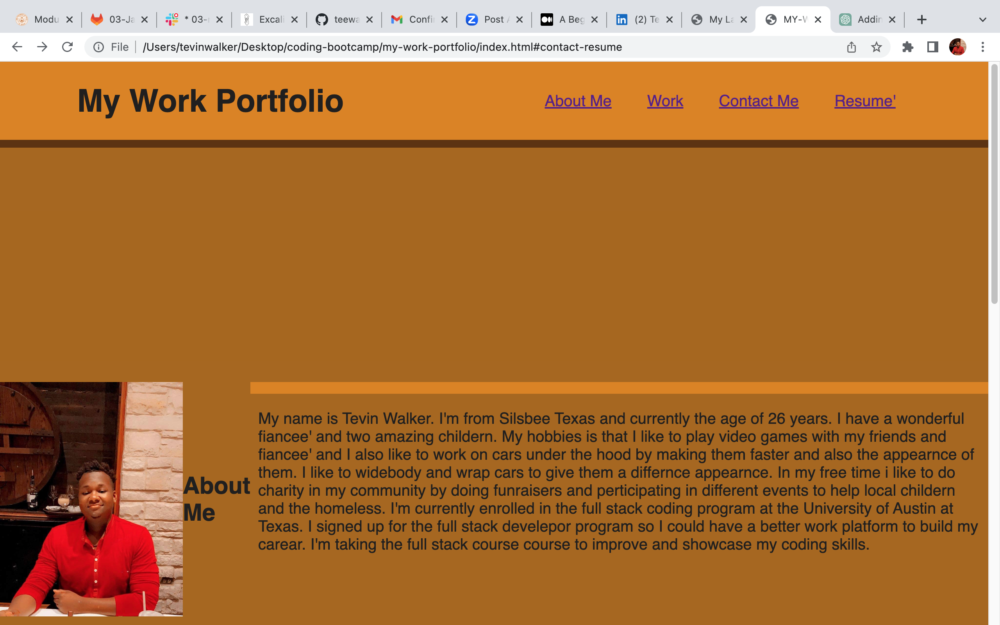

# my-work-portfolio

## Description

I was motivated to completed this project becuase a work portfolio is a good way for me to show what I have learned about coding and much more about myself. I built this project so an employer could view my work and resume' with a way to contact me if an employer wanted to conduct an interview.

## Installation

No steps needed to view this project.

## Usage

Provide instructions and examples for use. Include screenshots as needed.

To add a screenshot, create an `assets/images` folder in your repository and upload your screenshot to it. Then, using the relative file path, add it to your README using the following syntax:

## Credits

N/A

## License

MIT LICENSE
